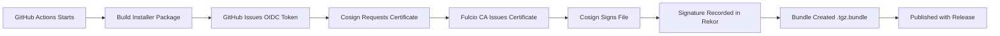

# Harbor Release Signature Verification Guide

## Overview

Starting with Harbor v2.14.0, all release artifacts (offline and online installers) are **cryptographically signed** using [Sigstore Cosign](https://docs.sigstore.dev/cosign/overview/) with **keyless signing**.

This guide will help you:
- ✅ Understand what signature verification is and why it matters
- ✅ Install the necessary tools
- ✅ Verify Harbor release artifacts step-by-step
- ✅ Troubleshoot common issues

## What is Keyless Signing?

Traditional code signing requires managing private keys, which can be:
- Lost or stolen
- Difficult to rotate
- Complex to manage securely

**Keyless signing** uses:
- **Short-lived certificates** issued by Sigstore's Certificate Authority
- **GitHub OIDC tokens** for authentication
- **Public transparency logs** (Rekor) for auditability

This means:
✅ No long-lived secrets to manage  
✅ Automatic verification of the build environment  
✅ Public audit trail of all signatures  

## Prerequisites

Install Cosign (v2.0.0 or later):

```bash
# Linux
curl -LO https://github.com/sigstore/cosign/releases/latest/download/cosign-linux-amd64
chmod +x cosign-linux-amd64
sudo mv cosign-linux-amd64 /usr/local/bin/cosign

# macOS (Intel)
curl -LO https://github.com/sigstore/cosign/releases/latest/download/cosign-darwin-amd64
chmod +x cosign-darwin-amd64
sudo mv cosign-darwin-amd64 /usr/local/bin/cosign

# macOS (Apple Silicon)
curl -LO https://github.com/sigstore/cosign/releases/latest/download/cosign-darwin-arm64
chmod +x cosign-darwin-arm64
sudo mv cosign-darwin-arm64 /usr/local/bin/cosign

# Windows (PowerShell)
curl.exe -LO https://github.com/sigstore/cosign/releases/latest/download/cosign-windows-amd64.exe
Move-Item -Path cosign-windows-amd64.exe -Destination C:\Windows\System32\cosign.exe
```

Or use a package manager:

```bash
# Homebrew (macOS/Linux)
brew install cosign

# Chocolatey (Windows)
choco install cosign
```

## Verifying Harbor Release Artifacts

### Step 1: Download the Installer and Signature Bundle

Each Harbor release includes both the installer and a `.bundle` file containing the signature:

```bash
# Example for v2.12.0 offline installer
wget https://github.com/goharbor/harbor/releases/download/v2.12.0/harbor-offline-installer-v2.12.0.tgz
wget https://github.com/goharbor/harbor/releases/download/v2.12.0/harbor-offline-installer-v2.12.0.tgz.bundle
```

### Step 2: Verify the Signature

Run the verification command:

```bash
cosign verify-blob \
  --bundle harbor-offline-installer-v2.12.0.tgz.bundle \
  --certificate-oidc-issuer https://token.actions.githubusercontent.com \
  --certificate-identity-regexp '^https://github.com/goharbor/harbor/.github/workflows/build-package.yml@refs/(heads/main|tags/v.*)$' \
  harbor-offline-installer-v2.12.0.tgz
```

**Successful output:**
```
Verified OK
```

**What this verifies:**
- ✅ The file was signed by the official Harbor GitHub Actions workflow
- ✅ The file hasn't been modified since signing
- ✅ The signature is recorded in Sigstore's public transparency log
- ✅ The signing certificate was issued for the correct GitHub repository and workflow

### Step 3: Inspect the Signature (Optional)

To see detailed information about the signature:

```bash
cosign verify-blob \
  --bundle harbor-offline-installer-v2.12.0.tgz.bundle \
  --certificate-oidc-issuer https://token.actions.githubusercontent.com \
  --certificate-identity-regexp '^https://github.com/goharbor/harbor/.github/workflows/build-package.yml@refs/(heads/main|tags/v.*)$' \
  --certificate-identity \
  harbor-offline-installer-v2.12.0.tgz | jq .
```

This shows:
- The GitHub Actions workflow that created the signature
- The exact commit SHA
- The timestamp
- The Rekor transparency log entry

## Automated Verification Script

Save this as `verify-harbor.sh`:

```bash
#!/bin/bash
set -e

VERSION="${1}"
TYPE="${2:-offline}"  # offline or online

if [ -z "$VERSION" ]; then
  echo "Usage: $0 <version> [offline|online]"
  echo "Example: $0 v2.12.0 offline"
  exit 1
fi

INSTALLER="harbor-${TYPE}-installer-${VERSION}.tgz"
BUNDLE="${INSTALLER}.bundle"
BASE_URL="https://github.com/goharbor/harbor/releases/download/${VERSION}"

echo "Downloading ${INSTALLER}..."
curl -LO "${BASE_URL}/${INSTALLER}"

echo "Downloading ${BUNDLE}..."
curl -LO "${BASE_URL}/${BUNDLE}"

echo "Verifying signature..."
cosign verify-blob \
  --bundle "${BUNDLE}" \
  --certificate-oidc-issuer https://token.actions.githubusercontent.com \
  --certificate-identity-regexp '^https://github.com/goharbor/harbor/.github/workflows/build-package.yml@refs/(heads/main|tags/v.*)$' \
  "${INSTALLER}"

echo ""
echo "✅ Signature verified successfully!"
echo "The installer is authentic and hasn't been tampered with."
```

Make it executable and use it:

```bash
chmod +x verify-harbor.sh
./verify-harbor.sh v2.12.0 offline
```

## Understanding the Verification Parameters

### `--certificate-oidc-issuer`
Specifies that the certificate must have been issued by GitHub Actions:
```
https://token.actions.githubusercontent.com
```

### `--certificate-identity-regexp`
Ensures the signature came from the official Harbor build workflow:
```
^https://github.com/goharbor/harbor/.github/workflows/build-package.yml@refs/(heads/main|tags/v.*)$
```

This regex matches:
- `refs/heads/main` - Commits to the main branch
- `refs/tags/v.*` - Release tags (e.g., v2.12.0)

## Troubleshooting

### Error: "certificate identity doesn't match"
**Cause:** The artifact wasn't signed by the official Harbor workflow.

**Solution:** Only download Harbor releases from the official GitHub releases page: https://github.com/goharbor/harbor/releases

### Error: "unable to find signature"
**Cause:** The bundle file wasn't downloaded or is corrupted.

**Solution:** Re-download the `.bundle` file and ensure it's in the same directory as the installer.

### Error: "bad signature"
**Cause:** The installer file has been modified after signing.

**Solution:** Re-download the installer from the official source. If the error persists, report it as a security issue.

## How Harbor's Signing Works



1. **Build**: GitHub Actions compiles Harbor
2. **OIDC Token**: GitHub proves the workflow's identity
3. **Certificate**: Sigstore's Fulcio CA issues a short-lived certificate
4. **Signing**: Cosign creates a cryptographic signature
5. **Transparency Log**: The signature is recorded in Rekor (public audit log)
6. **Bundle**: The signature, certificate, and log entry are packaged together
7. **Release**: The bundle is published alongside the installer

## Security Considerations

### What is Protected
✅ **Authenticity**: Proves the file came from Harbor's official build process  
✅ **Integrity**: Detects any modification to the file  
✅ **Non-repudiation**: Public record that the signing occurred  

### What is NOT Protected
❌ **Vulnerabilities**: Signing doesn't guarantee the software is bug-free  
❌ **GitHub Compromise**: If the goharbor/harbor repository is compromised  
❌ **Build-time Attacks**: Attacks during the build process will be signed  

### Best Practices
1. **Always verify** signatures before installing Harbor
2. **Use checksums** in addition to signatures (defense in depth)
3. **Verify the certificate identity** matches the official workflow
4. **Check Rekor logs** for unexpected signing events

## Additional Resources

- [Sigstore Documentation](https://docs.sigstore.dev/)
- [Cosign Documentation](https://docs.sigstore.dev/cosign/overview/)
- [Harbor Security Policy](../SECURITY.md)
- [Harbor Release Notes](https://github.com/goharbor/harbor/releases)

